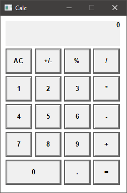

# Win32 Calc

This is an extremely simple and minimal calculator for the Windows operating system. It is built in Odin using the Win32 API.

    

This calculator is not special. It doesn't do anything more than your typical pocket calculator does and has not been tested thoroughly. I chose this as a small project I could finish in a few days during Christmas break.

## Build

If for some reason you want to build this, simply run the `build.bat` script (you need to have [Visual Studio](https://learn.microsoft.com/en-us/visualstudio/install/install-visual-studio?view=vs-2022) installed and an [Odin compiler](https://github.com/odin-lang/Odin) in your path).
